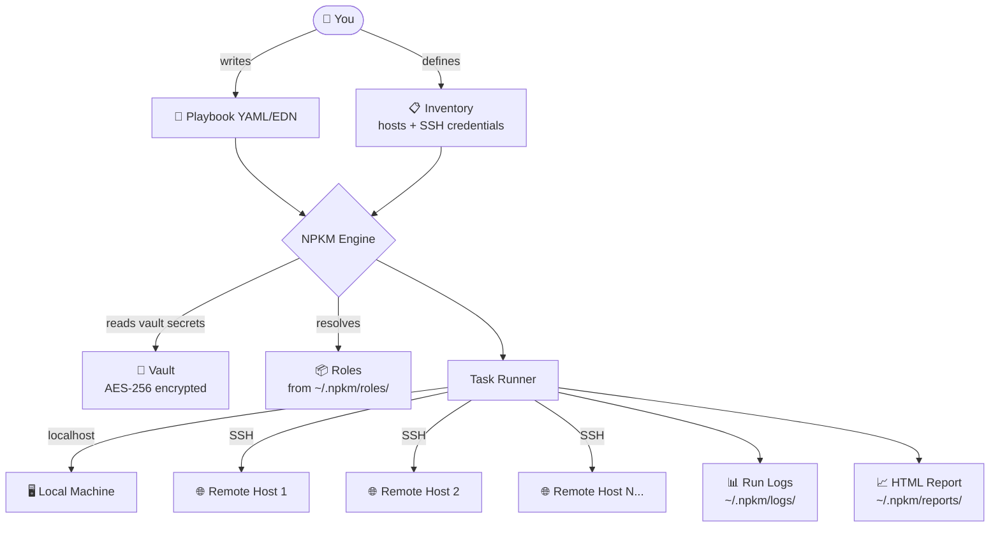
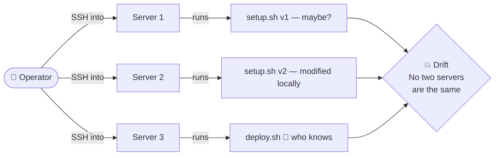
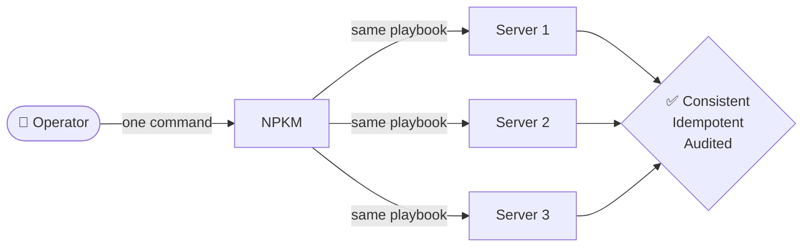
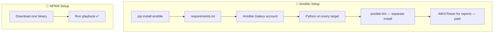
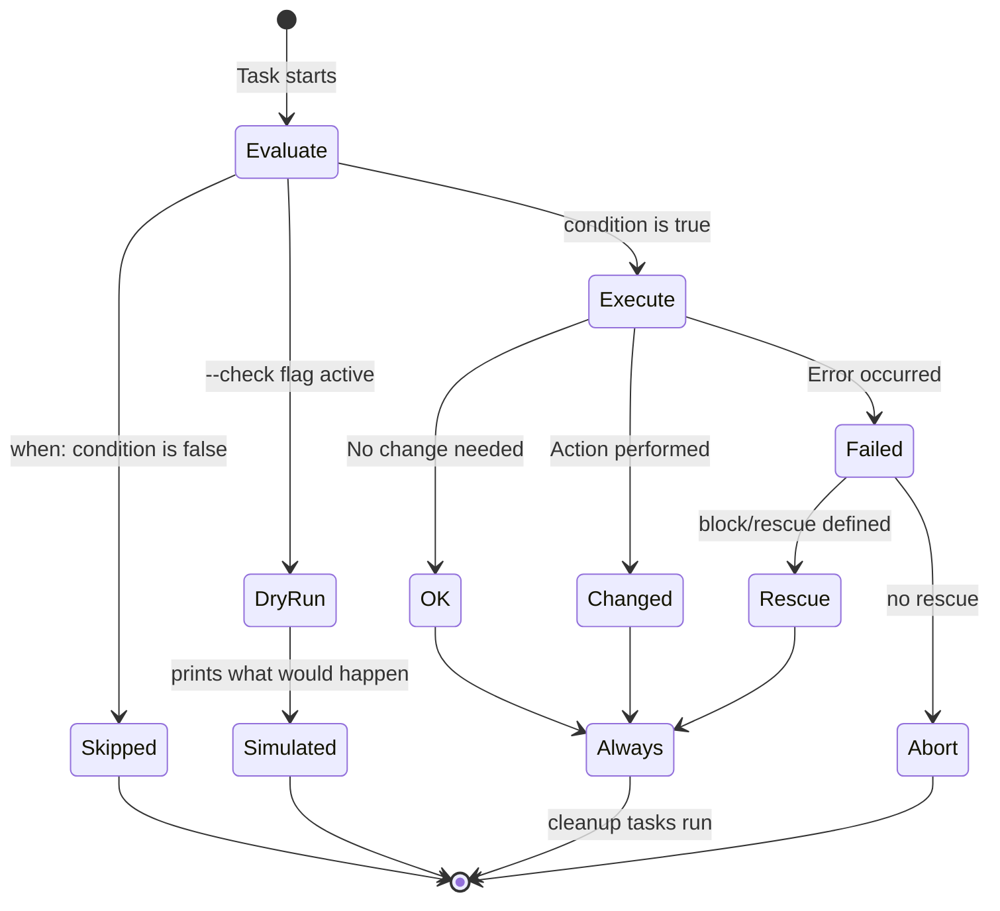
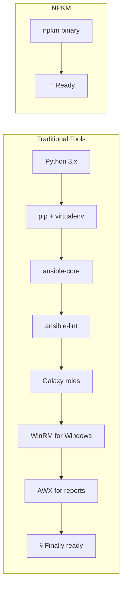
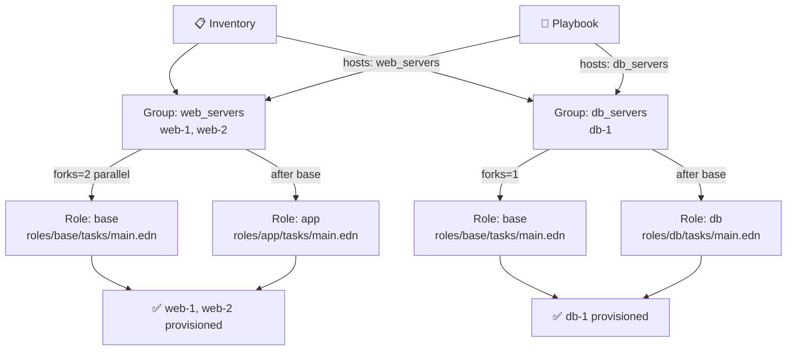
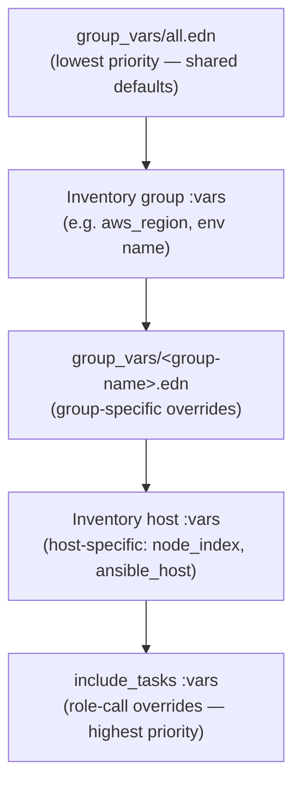
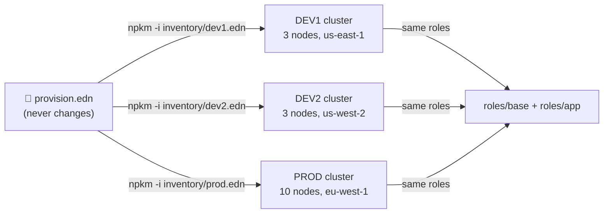

# NPKM — Plain Language Explainer

> **NPKM (Nuke Playbook Kit Manager)** is an automation engine that lets you describe system tasks in a declarative recipe file (a *playbook*), then executes them reliably — locally or across many machines over SSH — from a single, zero-dependency binary.

---

## What Problem Does It Solve?

When you manage infrastructure, you end up running the same commands over and over: installing packages, copying config files, restarting services, creating users. Doing this manually is error-prone, slow, and impossible to audit.

NPKM replaces that chaos with a **single, version-controlled playbook file**.

```yaml
- name: Set up web server
  hosts: all
  tasks:
    - apt:
        name: nginx
        state: present
    - copy:
        dest: /var/www/html/index.html
        content: "<h1>Hello, managed by NPKM!</h1>"
    - service:
        name: nginx
        state: started
        enabled: true
```

Run it with:

```bash
npkm -i inventory.yml playbook.yml
```

---

## How It Works — High Level



---

## NPKM vs. Running Scripts Manually

### The Manual Script Problem



### With NPKM



### Feature Comparison

| Pain Point with Scripts | How NPKM Fixes It |
|---|---|
| "Did I already run step 3?" | **Idempotency** — tasks report `ok`, `changed`, or `skipped`. Safe to re-run. |
| Script crashes halfway, leaves things broken | **`block / rescue / always`** — structured try/catch error handling |
| "Which server did I update?" | **Inventory + parallel SSH** — one run targets all hosts |
| Copy-pasting values across 10 scripts | **Variables & templating** — define once, use via `{{ var }}` |
| "Is this the prod or staging script?" | **`--check` dry-run** — simulates without changing anything |
| No audit trail | **Auto run logs + `--report`** — HTML/JSON saved per execution |
| Running steps manually in order | **Declarative tasks** with loops, conditions, and retry logic |
| Sharing scripts across the team is messy | **Roles** — reusable, Git-versioned task bundles |

---

## NPKM vs. Ansible

NPKM is explicitly designed for **full Ansible parity**, with the same YAML syntax and task model — but stripped of all Python baggage.



### Side-by-Side

| Feature | Ansible | NPKM |
|---|---|---|
| **Runtime** | Python + pip on controller & targets | **Single static binary — zero deps** |
| **Installation** | `pip install ansible` + Galaxy account | Download one binary, run |
| **Playbook format** | YAML only | YAML **and** EDN |
| **Inline scripting** | Jinja2 + custom Python modules | **`script:` module** — embed arbitrary scripting code directly in a task |
| **Dry-run** | `--check` (partial per module) | `--check` — clean simulation for `copy`, `file`, `remove` |
| **Execution reports** | AWX/Tower (external, paid) | **Built-in** HTML + JSON reports |
| **Watch mode** | ❌ Not built-in | ✅ `npkm watch` — auto re-run on file change |
| **Inline TDD assertions** | ❌ Not built-in | ✅ `test:` module — assert command output inline |
| **Run history & diff** | ❌ Not built-in | ✅ `npkm run history diff` |
| **Playbook linter** | `ansible-lint` — separate install | ✅ `npkm lint` built-in |
| **Interactive step mode** | `--step` | ✅ `--step` with y/n/q prompt |
| **Windows support** | WinRM (complex, brittle setup) | Native PowerShell + winget/choco |
| **Air-gapped environments** | Difficult | ✅ First-class — offline zip extraction, no internet required |
| **Project scaffolding** | ❌ Not built-in | ✅ `npkm init` — scaffold from zero in one command |
| **Auto-generated docs** | ❌ Not built-in | ✅ `npkm --doc` — Mermaid flowchart of your playbook |

---

## Task Lifecycle

Every task in NPKM goes through the same lifecycle:



---

## The Single Binary Advantage



---

## Key Commands at a Glance

```bash
# Run a playbook
npkm playbook.yml

# Run against remote hosts
npkm -i inventory.yml playbook.yml

# Dry run — simulate without changing anything
npkm --check playbook.yml

# Step through tasks one by one
npkm --step playbook.yml

# Target only specific hosts
npkm --limit web_servers playbook.yml

# Validate before running
npkm lint playbook.yml

# Watch files and auto re-run on change
npkm watch playbook.yml

# Generate an HTML execution report
npkm --report -i inventory.yml playbook.yml

# Generate Mermaid documentation of your playbook
npkm --doc playbook.yml

# Scaffold a new project
npkm init my-project/

# Install a reusable role from Git
npkm roles install git@github.com:myorg/nginx-role.git

# Browse run history
npkm run history diff
```

---

## Groups & Roles

NPKM has a first-class **group + role** system that mirrors Ansible's model exactly — without any extra tooling.

### What Is a Group?

A **group** is a named collection of hosts in your inventory. Groups let you target subsets of your infrastructure in a single `hosts:` declaration.

```edn
; inventory/prod.edn
{:web_servers
 {:vars {:app_port 8080}
  :hosts {:web-1 {:ansible_host "10.0.1.10" :ansible_user "ubuntu"}
          :web-2 {:ansible_host "10.0.1.11" :ansible_user "ubuntu"}}}
 :db_servers
 {:vars {:db_port 5432}
  :hosts {:db-1  {:ansible_host "10.0.2.10" :ansible_user "ubuntu"}}}}
```

```yaml
# Target only web servers
- name: Deploy app
  hosts: web_servers
  tasks:
    - apt:
        name: nginx
        state: present
```

### What Is a Role?

A **role** is a reusable bundle of tasks (and default variables) stored in a `roles/` directory. Instead of repeating the same tasks in every playbook, you write them once as a role and `include_tasks` them anywhere.

```
roles/
  base/
    tasks/main.edn     ← flat list of tasks (the entry point)
    defaults/main.edn  ← default variable values (lowest priority)
  app/
    tasks/main.edn
    defaults/main.edn
```

```edn
; roles/base/tasks/main.edn — a flat vector of tasks
[{:name "Create deploy user"
  :become true
  :shell {:cmd "useradd -m -s /bin/bash {{ app_user }} || true"}}

 {:name "Install baseline packages"
  :become true
  :shell {:cmd "apt-get install -y curl wget unzip jq"}}

 {:name "Install Java {{ java_version }}"
  :become true
  :shell {:cmd "apt-get install -y openjdk-{{ java_version }}-jre-headless"}}]
```

Use it in any playbook:

```edn
{:name "Provision cluster"
 :hosts "web_servers"
 :forks 3
 :tasks [{:name "OS Baseline"  :include_tasks "roles/base"}
         {:name "Deploy App"   :include_tasks "roles/app"}]}
```

### Groups + Roles Together



### group_vars — Automatic Group-Level Variables

Place variable files in a `group_vars/` directory next to your playbook. NPKM loads them automatically and merges them into the variable scope for matching groups:

```
group_vars/
  all.edn      ← loaded for every host in every group
  web_servers.edn  ← loaded only for hosts in the web_servers group
  db_servers.edn   ← loaded only for hosts in the db_servers group
```

```edn
; group_vars/all.edn — shared defaults
{:app_name    "myapp"
 :app_version "2.1.0"
 :java_version "21"}

; group_vars/web_servers.edn — web-specific overrides
{:app_port  8080
 :log_level "INFO"}

; group_vars/db_servers.edn — db-specific overrides
{:db_port   5432
 :log_level "WARN"}
```

### Variable Resolution Order

When a task runs on a host, variables are merged in this exact priority order (highest wins):



In practice: a variable defined at the role-call level always beats a variable from `group_vars/all.edn`.

### Remote Role Install

Roles can also be installed from any Git repository and shared across projects:

```bash
# Install a role globally into ~/.npkm/roles/
npkm roles install git@github.com:myorg/nginx-role.git

# Install a specific version
npkm roles install git@gitlab.example.com:sys/samba.git --version v1.2.0
```

Then reference it the same way:

```yaml
- name: Configure Samba
  include_tasks: roles/samba
  vars:
    share_name: MY_SHARE
    share_path: /mnt/data
```

### Multi-Environment Pattern

The group + role system enables a powerful pattern: **one playbook, swappable inventories**.



DEV1 and PROD differ only in their inventory + `group_vars` files. The playbook and all roles stay identical. To provision a new environment, you add one inventory file — nothing else changes.

---

## Summary

| | Manual Scripts | Ansible | NPKM |
|---|---|---|---|
| Repeatable | ⚠️ Fragile | ✅ Yes | ✅ Yes |
| Idempotent | ❌ You handle it | ✅ Yes | ✅ Yes |
| Multi-host | ❌ Manual SSH | ✅ Yes | ✅ Yes |
| Zero setup | ✅ Already have bash | ❌ Needs Python | ✅ One binary |
| Windows native | ⚠️ Batch/PS scripts | ❌ WinRM pain | ✅ First-class |
| Air-gapped | ✅ Works | ⚠️ Difficult | ✅ First-class |
| Built-in reports | ❌ | ❌ (paid) | ✅ |
| Inline scripting | ✅ Shell | ❌ Jinja2 only | ✅ Built-in scripting |
| Linter | ❌ | ❌ (separate) | ✅ Built-in |
| Watch mode | ❌ | ❌ | ✅ Built-in |
