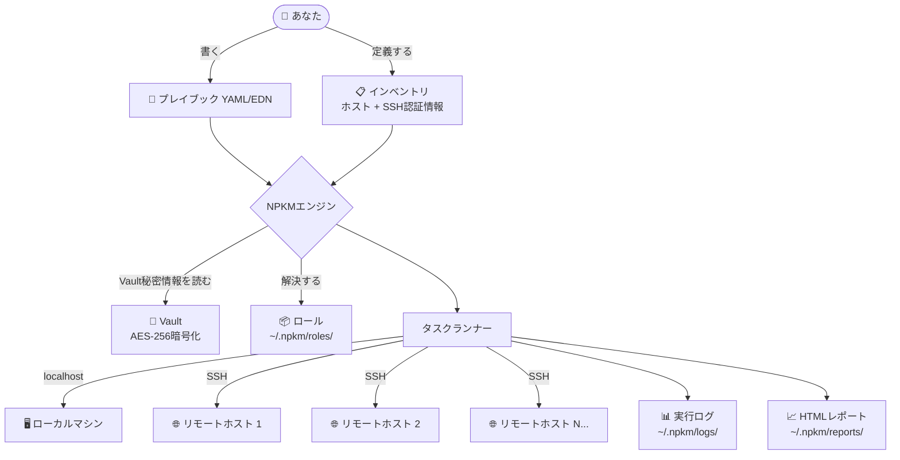
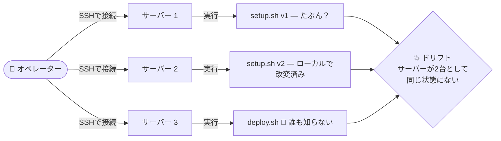
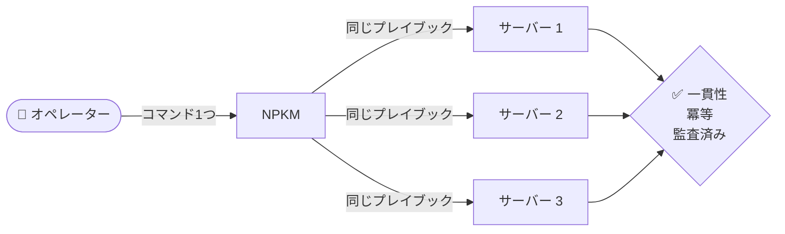
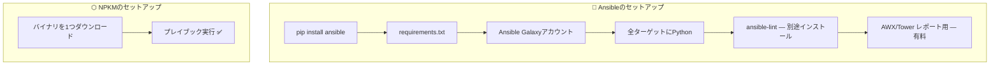
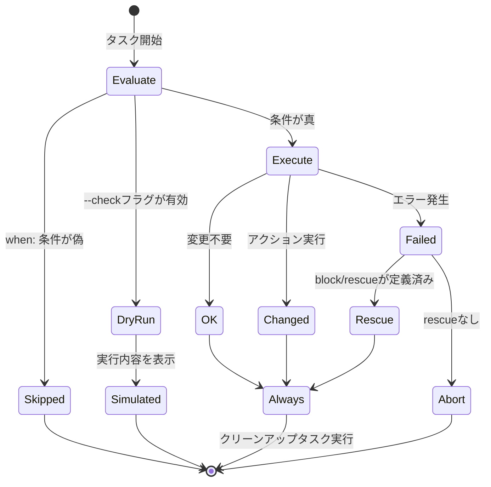
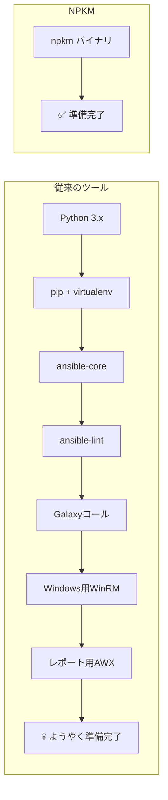
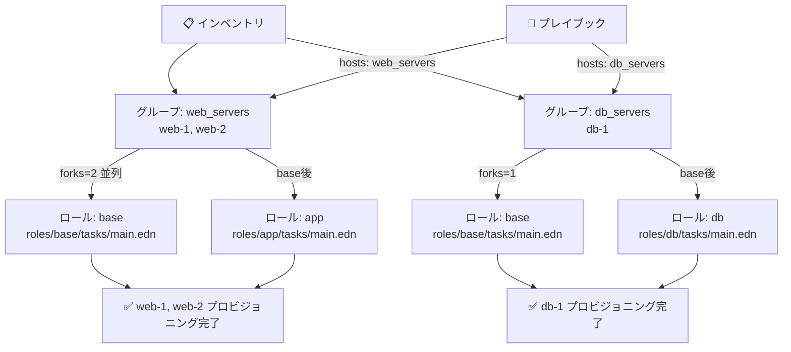
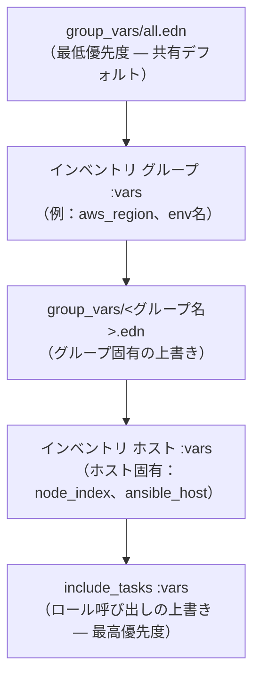
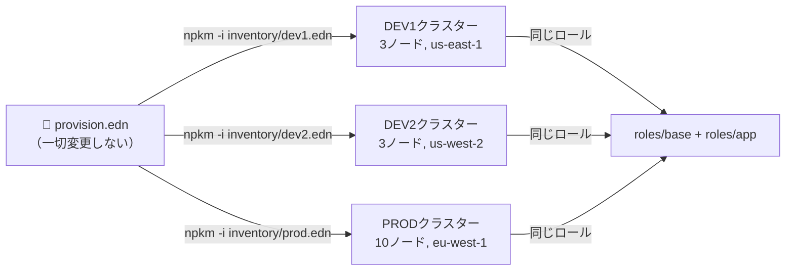

# NPKM — やさしい言葉で説明する

> **NPKM（Nuke Playbook Kit Manager）**は、システムのタスクを宣言的なレシピファイル（*プレイブック*）に記述し、それを単一の依存関係ゼロのバイナリから、ローカルまたはSSH経由で複数のマシンに対して確実に実行する自動化エンジンだ。

---

## どんな問題を解決するのか？

インフラを管理していると、同じコマンドを何度も実行することになる。パッケージのインストール、設定ファイルのコピー、サービスの再起動、ユーザーの作成。これを手動でやるのはミスが多く、遅く、監査が不可能だ。

NPKMはそのカオスを**バージョン管理された単一のプレイブックファイル**に置き換える。

```yaml
- name: ウェブサーバーのセットアップ
  hosts: all
  tasks:
    - apt:
        name: nginx
        state: present
    - copy:
        dest: /var/www/html/index.html
        content: "<h1>Hello, NPKMが管理しています！</h1>"
    - service:
        name: nginx
        state: started
        enabled: true
```

実行はこれだけ：

```bash
npkm -i inventory.yml playbook.yml
```

---

## 仕組み — 全体像



---

## NPKM vs. スクリプトの手動実行

### スクリプト手動実行の問題



### NPKMを使う場合



### 機能比較

| スクリプトの悩み | NPKMの解決策 |
|---|---|
| 「ステップ3はもう実行したっけ？」 | **冪等性** — タスクは `ok`、`changed`、`skipped` を報告。何度実行しても安全。 |
| スクリプトが途中でクラッシュして壊れたまま | **`block / rescue / always`** — 構造化されたtry/catchエラーハンドリング |
| 「どのサーバーを更新したんだっけ？」 | **インベントリ + 並列SSH** — 1回の実行で全ホストを対象 |
| 10個のスクリプトに値をコピペ | **変数とテンプレート** — 一度定義して `{{ var }}` で使い回す |
| 「これは本番用？ステージング用？」 | **`--check` ドライラン** — 何も変更せずシミュレート |
| 監査証跡がない | **自動実行ログ + `--report`** — 実行ごとにHTML/JSONを保存 |
| 手順を順番に手動実行 | **宣言的タスク** — ループ、条件分岐、リトライロジック付き |
| チーム間でスクリプトを共有するのが大変 | **ロール** — 再利用可能なGitバージョン管理タスクバンドル |

---

## NPKM vs. Ansible

NPKMは**Ansibleと完全な互換性**を持つように明示的に設計されており、同じYAML構文とタスクモデルを採用しているが、Pythonの荷物を全て取り除いている。



### 並べて比較

| 機能 | Ansible | NPKM |
|---|---|---|
| **ランタイム** | コントローラーとターゲット両方にPython + pip | **単一の静的バイナリ — 依存関係ゼロ** |
| **インストール** | `pip install ansible` + Galaxyアカウント | バイナリを1つダウンロードして実行 |
| **プレイブック形式** | YAMLのみ | YAML **と** EDN |
| **インラインスクリプト** | Jinja2 + カスタムPythonモジュール | **`script:` モジュール** — タスク内に任意のスクリプトを直接埋め込む |
| **ドライラン** | `--check`（モジュールによる部分対応） | `--check` — `copy`、`file`、`remove` をクリーンにシミュレート |
| **実行レポート** | AWX/Tower（外部、有料） | **ビルトイン** HTML + JSONレポート |
| **ウォッチモード** | ❌ 非搭載 | ✅ `npkm watch` — ファイル変更で自動再実行 |
| **インラインTDDアサーション** | ❌ 非搭載 | ✅ `test:` モジュール — コマンド出力をインラインでアサート |
| **実行履歴と差分** | ❌ 非搭載 | ✅ `npkm run history diff` |
| **プレイブックリンター** | `ansible-lint` — 別途インストール | ✅ `npkm lint` ビルトイン |
| **インタラクティブステップモード** | `--step` | ✅ `--step` — y/n/qプロンプト付き |
| **Windowsサポート** | WinRM（複雑で不安定なセットアップ） | ネイティブPowerShell + winget/choco |
| **エアギャップ環境** | 困難 | ✅ 完全対応 — オフラインzip展開、インターネット不要 |
| **プロジェクトスキャフォールディング** | ❌ 非搭載 | ✅ `npkm init` — コマンド1つでゼロからスキャフォールド |
| **自動生成ドキュメント** | ❌ 非搭載 | ✅ `npkm --doc` — プレイブックのMermaidフローチャートを生成 |

---

## タスクのライフサイクル

NPKMのすべてのタスクは同じライフサイクルを経る：



---

## 単一バイナリの優位性



---

## コマンド早見表

```bash
# プレイブックを実行
npkm playbook.yml

# リモートホストに対して実行
npkm -i inventory.yml playbook.yml

# ドライラン — 何も変更せずシミュレート
npkm --check playbook.yml

# タスクを1つずつステップ実行
npkm --step playbook.yml

# 特定のホストのみを対象にする
npkm --limit web_servers playbook.yml

# 実行前に検証
npkm lint playbook.yml

# ファイル変更を監視して自動再実行
npkm watch playbook.yml

# HTML実行レポートを生成
npkm --report -i inventory.yml playbook.yml

# プレイブックのMermaidドキュメントを生成
npkm --doc playbook.yml

# 新しいプロジェクトをスキャフォールド
npkm init my-project/

# GitからReusableロールをインストール
npkm roles install git@github.com:myorg/nginx-role.git

# 実行履歴を確認
npkm run history diff
```

---

## グループとロール

NPKMは**グループ + ロール**システムを一等市民として持っており、Ansibleのモデルを完全に踏襲している — 追加のツールは一切不要だ。

### グループとは何か？

**グループ**はインベントリ内のホストの名前付きコレクションだ。グループを使えば、単一の `hosts:` 宣言でインフラのサブセットを対象にできる。

```edn
; inventory/prod.edn
{:web_servers
 {:vars {:app_port 8080}
  :hosts {:web-1 {:ansible_host "10.0.1.10" :ansible_user "ubuntu"}
          :web-2 {:ansible_host "10.0.1.11" :ansible_user "ubuntu"}}}
 :db_servers
 {:vars {:db_port 5432}
  :hosts {:db-1  {:ansible_host "10.0.2.10" :ansible_user "ubuntu"}}}}
```

```yaml
# ウェブサーバーのみを対象にする
- name: アプリのデプロイ
  hosts: web_servers
  tasks:
    - apt:
        name: nginx
        state: present
```

### ロールとは何か？

**ロール**は `roles/` ディレクトリに格納された再利用可能なタスクのバンドル（とデフォルト変数）だ。プレイブックごとに同じタスクを繰り返す代わりに、一度ロールとして書いておけば、どこでも `include_tasks` できる。

```
roles/
  base/
    tasks/main.edn     ← タスクのフラットリスト（エントリーポイント）
    defaults/main.edn  ← デフォルト変数値（最低優先度）
  app/
    tasks/main.edn
    defaults/main.edn
```

```edn
; roles/base/tasks/main.edn — タスクのフラットベクター
[{:name "デプロイユーザーを作成"
  :become true
  :shell {:cmd "useradd -m -s /bin/bash {{ app_user }} || true"}}

 {:name "ベースラインパッケージをインストール"
  :become true
  :shell {:cmd "apt-get install -y curl wget unzip jq"}}

 {:name "Java {{ java_version }} をインストール"
  :become true
  :shell {:cmd "apt-get install -y openjdk-{{ java_version }}-jre-headless"}}]
```

任意のプレイブックで使用する：

```edn
{:name "クラスターのプロビジョニング"
 :hosts "web_servers"
 :forks 3
 :tasks [{:name "OSベースライン"  :include_tasks "roles/base"}
         {:name "アプリデプロイ"  :include_tasks "roles/app"}]}
```

### グループ + ロールの組み合わせ



### group_vars — グループレベル変数の自動読み込み

`group_vars/` ディレクトリにプレイブックと並べて変数ファイルを置く。NPKMはそれを自動的に読み込み、一致するグループの変数スコープにマージする：

```
group_vars/
  all.edn             ← 全グループの全ホストに読み込まれる
  web_servers.edn     ← web_serversグループのホストのみに読み込まれる
  db_servers.edn      ← db_serversグループのホストのみに読み込まれる
```

```edn
; group_vars/all.edn — 共有デフォルト
{:app_name    "myapp"
 :app_version "2.1.0"
 :java_version "21"}

; group_vars/web_servers.edn — ウェブ固有の上書き
{:app_port  8080
 :log_level "INFO"}

; group_vars/db_servers.edn — DB固有の上書き
{:db_port   5432
 :log_level "WARN"}
```

### 変数の解決順序

タスクがホスト上で実行される際、変数は以下の正確な優先度順（高いほど勝つ）でマージされる：



実際のところ：ロール呼び出しレベルで定義された変数は、`group_vars/all.edn` の変数より常に優先される。

### リモートロールのインストール

ロールは任意のGitリポジトリからインストールしてプロジェクト間で共有することもできる：

```bash
# ~/.npkm/roles/ にグローバルにロールをインストール
npkm roles install git@github.com:myorg/nginx-role.git

# 特定のバージョンをインストール
npkm roles install git@gitlab.example.com:sys/samba.git --version v1.2.0
```

あとは同じように参照する：

```yaml
- name: Sambaを設定
  include_tasks: roles/samba
  vars:
    share_name: MY_SHARE
    share_path: /mnt/data
```

### マルチ環境パターン

グループ + ロールシステムは強力なパターンを実現する：**1つのプレイブック、交換可能なインベントリ**。



DEV1とPRODの違いはインベントリと `group_vars` ファイルだけだ。プレイブックとすべてのロールは同一のまま。新しい環境をプロビジョニングするには、インベントリファイルを1つ追加するだけ — 他は何も変わらない。

---

## まとめ

| | 手動スクリプト | Ansible | NPKM |
|---|---|---|---|
| 再現性 | ⚠️ 脆弱 | ✅ あり | ✅ あり |
| 冪等性 | ❌ 自分で実装 | ✅ あり | ✅ あり |
| マルチホスト | ❌ 手動SSH | ✅ あり | ✅ あり |
| ゼロセットアップ | ✅ bashがある | ❌ Python必要 | ✅ バイナリ1つ |
| Windowsネイティブ | ⚠️ Batch/PSスクリプト | ❌ WinRMが辛い | ✅ 完全対応 |
| エアギャップ | ✅ 動く | ⚠️ 困難 | ✅ 完全対応 |
| ビルトインレポート | ❌ | ❌（有料） | ✅ |
| インラインスクリプト | ✅ シェル | ❌ Jinja2のみ | ✅ ビルトインスクリプト |
| リンター | ❌ | ❌（別途） | ✅ ビルトイン |
| ウォッチモード | ❌ | ❌ | ✅ ビルトイン |
