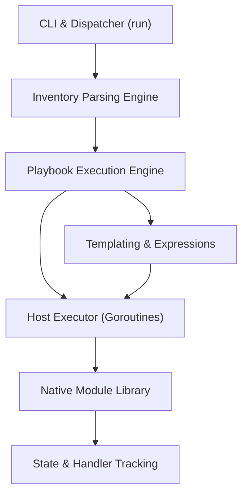
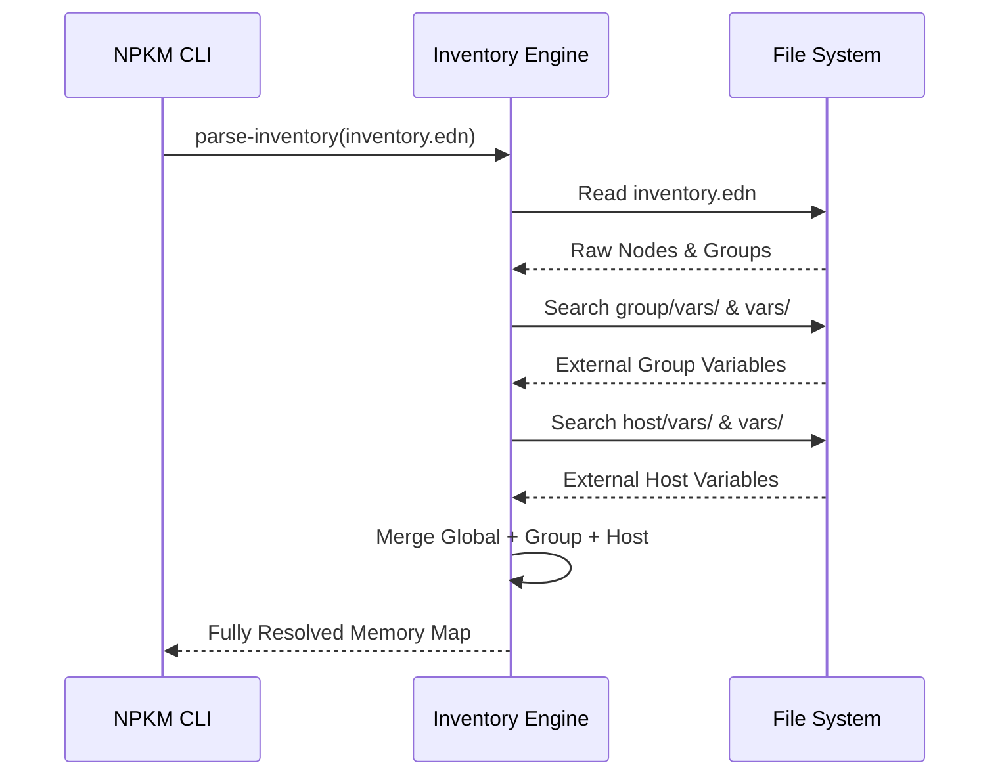
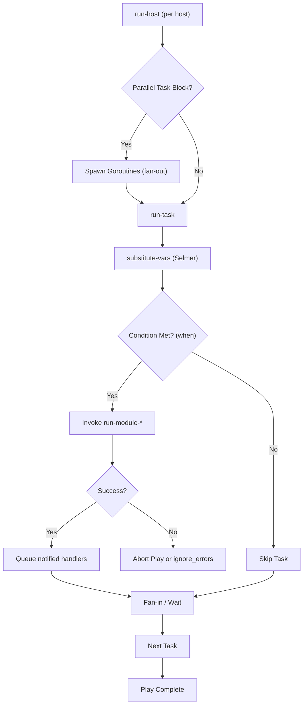

# NPKM Architecture

NPKM (Nova Playbook Kernel Manager) is a high-performance, Ansible-compatible IT automation and orchestration engine written entirely in **Coni** (a modern, statically compiled Lisp dialect). NPKM leverages Coni's native AOT compilation to deliver a dependency-free, zero-overhead binary that fundamentally outperforms Python-based orchestration tools.

This document outlines the core subsystems, execution flow, and module architecture of NPKM.

## 1. High-Level Overview

NPKM operates on a similar mental model to Ansible—using **Playbooks**, **Inventories**, **Roles**, and **Modules**—but reimagines the execution backend for concurrency and speed. 

The system is encapsulated primarily within `npkm-coni/main.coni` and consists of five core layers:



1. **CLI / Dispatcher** (`run`, `npkm-init`, `npkm-lint`, `npkm-watch`)
2. **Inventory Parsing Engine** (`parse-inventory`, `load-external-vars`, `get-hosts`)
3. **Playbook Execution Engine** (`execute-playbook`, `run-host`, `run-task`)
4. **Variable & Templating Engine** (`substitute-vars`, `eval-condition`)
5. **Native Module Library** (`run-module-*`)

---

## 2. Execution Flow

When a user invokes `npkm -i inventory.edn playbook.yml`, the lifecycle is as follows:

### A. Initialization & Argument Parsing
The entrypoint `(run)` parses command-line arguments, extracting operational flags like `--dry-run`, `--diff`, `--step`, `-t` (tags), and `--forks`. It initializes global state trackers.

### B. Inventory Parsing & Variable Resolution
The `parse-inventory` engine evaluates the target `-i` argument. NPKM supports Static EDN/YAML, dynamic scripts, and dynamic variables.



### C. Playbook Evaluation & Concurrency Model
The `execute-playbook` function iterates through defined plays. For each play:
1. It resolves the `hosts` target against the parsed inventory.
2. It determines the concurrency level (`forks`).
3. If `forks > 1`, NPKM uses Coni's native `spawn` and `chan` (channels) to fan-out host execution. Each host gets a dedicated goroutine, avoiding Python multiprocess forking.

### D. Host & Task Execution
For each targeted host, `run-host` evaluates the tasks sequentially or in parallel.



---

## 3. Module Architecture

Unlike Ansible which pushes Python scripts via SSH, NPKM executes natively. The module library is strictly built-in to `main.coni`, meaning no remote dependencies are required. 

Each module conforms to a strict signature, generally:
```clojure
(defn run-module-<name> [args runtime-vars is-dry-run is-diff is-bw])
```
It returns a state map: `{:output "...", :changed false, :failed false, :vars {...}}`

### Core Modules
- **Execution**: `command`, `shell`
- **File System**: `file`, `copy`, `template`, `unzip`, `move`, `remove`
- **Text Manipulation**: `lineinfile`, `replace`
- **Utilities**: `debug`, `pause`, `set_fact`, `assert`, `fail`
- **Network**: `get_url`, `git`

Modules support standard directives like `ignore_errors`, `register`, `changed_when`, and `failed_when`.

---

## 4. Advanced Subsystems

### A. Secret Management (Vault)
NPKM includes a native `vault` subsystem. Files encrypted with Vault are transparently decrypted in memory during the `parse-inventory` or playbook loading phase using AES-GCM, matching the experience of `ansible-vault` but compiled directly into the binary.

### B. Static Analysis & Linting
The `npkm-lint` engine performs AST-level analysis on playbooks before execution. It validates module arguments against a strict schema and reports warnings without executing code.

### C. Documentation Generation (`--doc`)
A standout feature of NPKM's architecture is its ability to parse an abstract playbook and dynamically generate a **Mermaid** workflow diagram mapping the execution paths, roles, and conditions natively to `stdout`.

### D. Interactive Debugging
NPKM supports a `--step` mode which pauses execution before every task, printing interpolated variables and prompting the operator for continuation.

---

## 5. Compilation Pipeline & Reusable Core

A key architectural advantage of NPKM is the underlying language and toolchain. 

### Coni DSL to Native Binary
The entire application is written in **Coni**, a high-level Lisp dialect. During the build process, the Coni compiler transpiles the Coni syntax directly into highly optimized **Go (Golang)** code. The standard Go toolchain then compiles this output into a single, statically linked native executable.
- **`coni dsl -> go source -> native binary`**

This pipeline guarantees the expressive power and data-driven capabilities of Lisp, paired with the lightweight concurrency model (goroutines) and raw execution speed of a compiled systems language, resulting in a dependency-free binary that fundamentally outperforms Python-based alternatives.

### Common Libraries & Reusable Code
The ecosystem leverages a shared standard library of modular, natively transpiled components under `libs/`:
- **`libs/os`**: Provides low-level operating system bindings, file I/O operations, logging, and raw subprocess execution for module bridging.
- **`libs/str`**: Comprehensive string manipulation and formatting functions.
- **`libs/edn`**: High-performance parser for Extensible Data Notation, used heavily during inventory and playbook parsing.

These shared libraries ensure consistency, memory safety, and high performance across the Coni ecosystem, enabling rapid development of complex orchestration modules without writing boilerplate native extensions.
